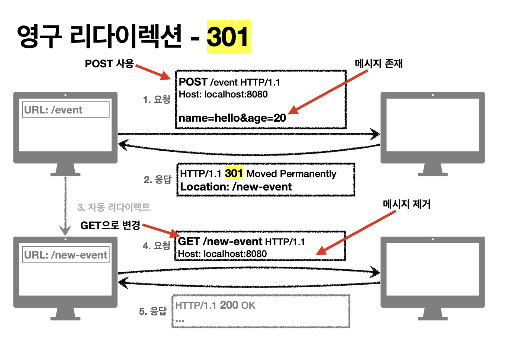
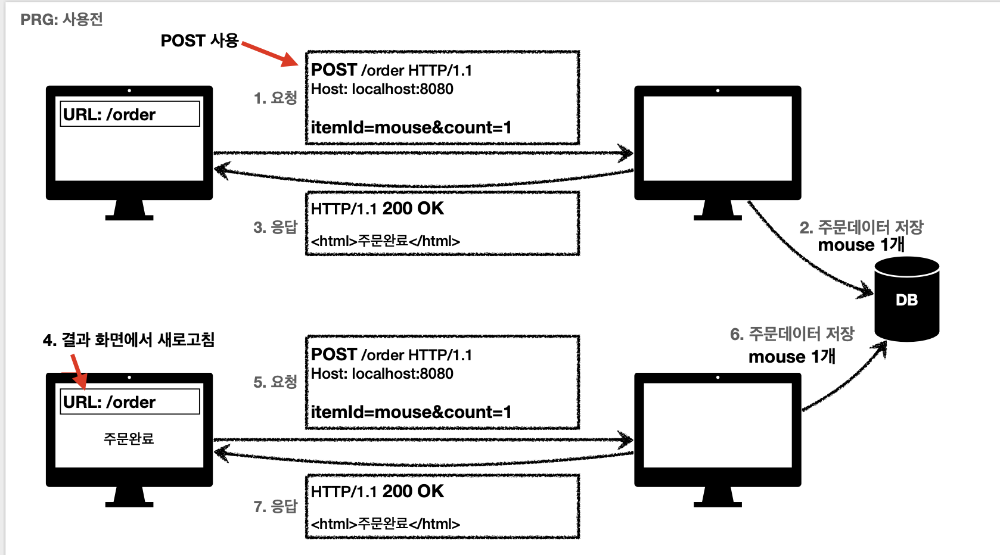
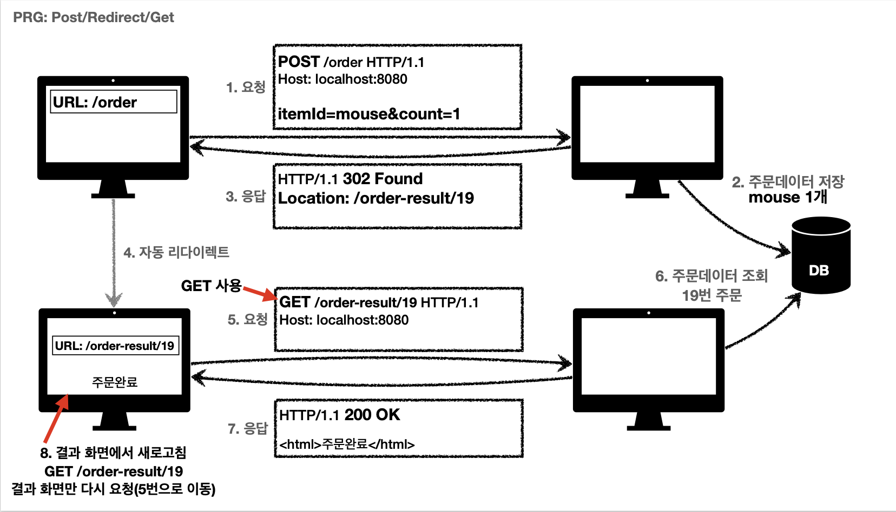
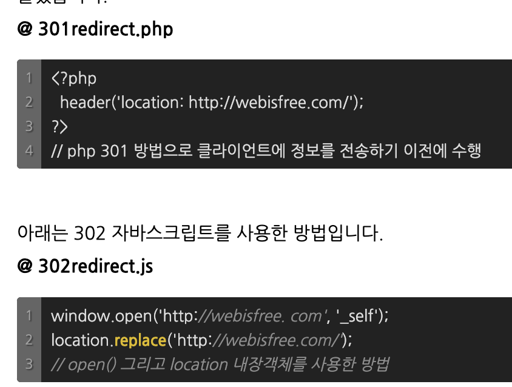
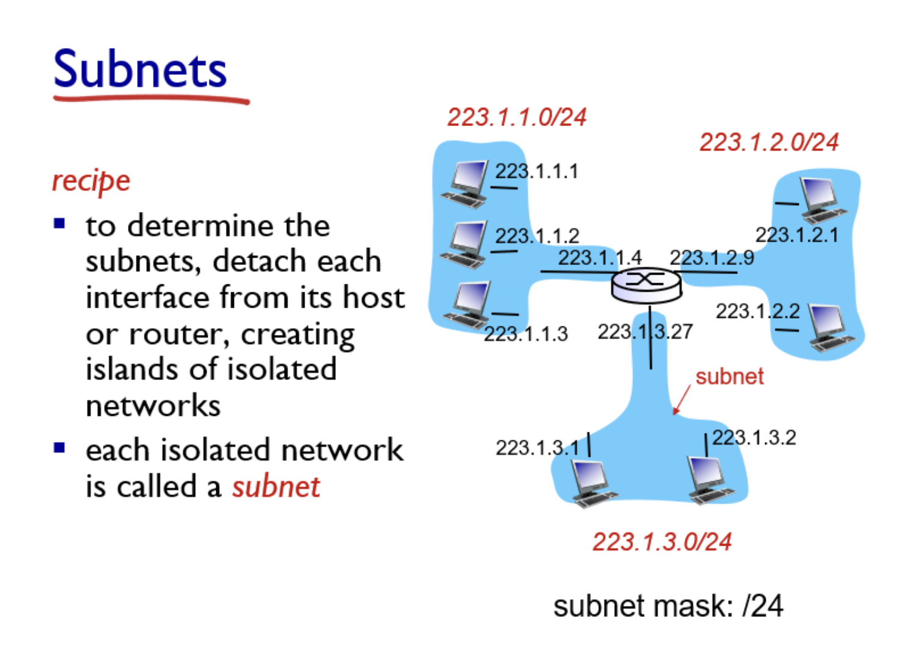

### [chapter 01_웹브라우저]

- (1). HTTP 리퀘스트 메시지를 작성한다.
    1. **URL (Uniform Resource Locator)**
        - 구성요소
            - 프로토콜 (http, ftp, malito)
            - 서버이름 (도메인 이름)
            - 경로 (데이터 출처(파일)의 경로명 / 폴더구조)
            - 포트번호(80:http, 443:https)
            - 프래그먼트(Fragment) : 웹페이지내 특정 부분을 가리키는데에 사용

          ex) **https://www.example.com:8080/path/to/resource?param1=value1&param2=value2#section2**

          → 위 예시 URL에서 프로토콜은 "https", 도메인은 "**[www.example.com](http://www.example.com/)**", 포트는 8080, 경로는 "/path/to/resource", 쿼리 문자열은 "param1=value1&param2=value2", 프래그먼트는 "section2"를 나타냅니다.

    2. **파일명을 생략한 경우**
        - ex) http://www.lab.cyber.co.kr/dir/

          → ‘/’ 다음 파일명을 생략한 것.
          ’/dir/index.html’ 혹은 ‘/dir/default.htm’ 이라는 파일에 엑세스하는것.
          기본 파일에 엑세스가 되도록 서버측에서 설정을 해둠

        - ex) http://www.lab.cyber.co.kr/whatisthis

          → 맨 끝에 ‘/’가 없는경우

            - ‘/’까지 생략가능한 경우가 존재
            - ‘whatisthis’라는 것은 파일명이 될 수도있고 디렉토리(경로)가 될 수도 있음
            - 그래서 ‘whatisthis’라는 파일이 있으면 파일, 디렉토리가 있으면 디렉토리로 여김
    3. **URI (Uniform Resource Identifier)**
        - ‘무엇을’에 해당함
        - HTTP 메서드(동작)과 연결지어서 해석
            - uri와 http메서드를 보고 ‘무엇을‘,  ‘어떻게’ 라는 추측이 가능
    4. **HTTP Method**
        - GET (조회, 멱등)
        - POST (생성, 멱등하지 않음)
        - PUT (수정, 멱등함)
        - PATCH (수정, 멱등할수도, 안할수도)
            - put, patch

              → put은 리소스 전체를 갈아끼우는 것이기에, 갈아끼울(update할) 데이터를 넘겨줌. 몇번을 넘겨주던 결과는 같음

              → patch는 리소스 일부를 수정.(기존 데이터에 변경 사항을 적용하여 업데이트)

                - 리소스의 일부를 10에서 11로 수정하기위해 11이라는 데이터를 넘겨주는 거라면 ‘멱등’
                - 하지만 10에서 11로 수정하기위해 현재 값(10)에 의존해서 변경을 수행하게 되면 이 patch작업을 반복할 때 마다 값이 변하게됨 → 멱등X
        - DELETE(삭제, 멱등하지 않음)
            - - delete요청 후 리소스가 존재하지 않아 멱등하지 않음
    5. **HTTP 리퀘스트 메시지를 만든다. `체크`**
        - HTTP 리퀘스트 메시지 - 포맷이 정해져있음.
            - 리퀘스트라인
            - 메시지헤더
            - 메시지본문
        - HTTP 응답 메시지
            - 스테이터스 라인
            - 메시지 헤더
            - 메시지본문
    6. 리퀘스트 메시지를 보내면 응답이 되돌아옴.
        - HTTP 응답
            - 1xx : 서버의 요청을 받았으며 작업을 계속 진행한다는 상태 코드들의 집합(거의사용x)
                - 100 : Continue
                - 101 : Switching Protocol
            - 2xx : 성공(요청정상)
                - 200 : OK
                - 201 : Created
                - 202 : Accepted
                    - 요청이 접수되었으나 처리가 완료되지 않았음.
                    - 배치 처리 같은 곳에서 사용
                    - 예) 요청 접수 후 1시간 뒤에 배치 프로세스가 요청을 처리함
                - 204 : No content
                    - 서버가 요청을 성공적으로 수행했지만, 응답 페이로드 본문에 보낼 데이터가 없음
                    - save 버튼의 결과로 아무 내용이 없어도 됨.
                      → 내용이 없어도 204 메시지 만으로 성공임을 알 수 있음.
            - 3xx : 서버는 요청을 성공적으로 처리했지만, 클라이언트는 요청을 마치기 위해 추가 동작을 취해야 한다는 코드들의 집합 : Redirect
                - **301 : Moved Permanently redirect (영구적 이동)**
                    - 리다이렉트시 요청 메서드가 GET으로 변하고, 본문이 제거될 수 있음.
                    - 서버를 거치지 않고 바로 클라이언트에서 요청을 보냄

                        ```php
                        <?
                        header( "HTTP/1.1 301 Moved Permanently" );
                        header( "Location: http://www.new-url.com" );
                        ?>
                        ```

                    - 영구 리다이렉션 : 특정 리소스의 URI가 영구적으로 이동

                      

                        - 예) /members → /users
                        - 예) /event → /new-event
                - **302 : Found temporary redirect (일시적 이동)**
                    - 서버로직을 거치고 리다이렉트를 시켜야 하는경우: 302
                    - 일시적으로 옮겨간 것이기 때문에, 사이트가 옮겨갔다는 것을 감지하더라도 검색결과에 아무 변화를 주지 않는다.
                    - ****리다이렉트시 요청 메서드가 GET으로 변하고, 본문이 제거될 수 있음(MAY)****
                    - **일시 리다이렉션** : 일시적인 변경
                        - 주문 완료 후 주문 내역 화면으로 이동
                        - **`PRG`** : Post/Redirect/Get

                          

                            - POST요청으로 주문을 하거나 , POST요청으로 댓글/게시글을 등록한 후에 **새로고침을 하면 POST요청이 중복발생 할 수 있음**
                            - 이를 해결하기위해 `Redirect`을 사용
                            - POST로 주문 후 새로고침으로 인한 중복 데이터전송을 방지
                            - POST로 주문 후 결과 화면을 GET메서드로 리다이렉트함
                            - 새로고침해도 결과 화면을 GET으로 조회하는 것
                            - 중복 주문 대신에 결과 화면만 GET으로 다시 요청하는거임

                              


                → 301과 302 redirect의 차이`??`
                
                - 차이 예시
                    
                    http://japong.com/tutorials/seo/301_redirect.html
                    
                    - **301 리다이렉션**
                        
                        예를 들어 aaa.com을 소유했던 사람이 bbb.com으로 사이트 주소를 옮겼을때 301 redirect를 해준다면 크롤러가 aaa.com에 접속했을때 aaa.com에서 인덱스한 내용의 주소가 bbb.com으로 바뀌었다는것을 감지하고 인덱스된 aaa.com의 주소를 자동으로 bbb.com으로 변경시켜 준다.
                        
                        이럴경우 ‘aaa’라는 키워드로 aaa.com이 검색결과에 나오던것이 bbb.com으로 나오게 된다. 이렇게 되면 사이트 관리자는 손쉽게 검색엔진에 변경된 사항을 적용할수 있게되고 검색엔진을 통해 유입되는 트래픽을 잃지 않게 된다. 그외에 www.aaa.com을 ‘www’가 빠진 aaa.com으로 지정하고 싶다던지 [www.aaa.com/product.html?a=samsung&b=galaxy&c=tab](http://www.aaa.com/product.html?a=samsung&b=galaxy&c=tab) 같은 url을 [www.aaa.com/samsung/galaxy/tab](http://www.aaa.com/samsung/galaxy/tab) 같이 읽기 쉬운 형식으로 바꾸고 싶을때 유용하게 쓰인다.
                        
                    - **302 리다이렉션**
                        
                        크롤러는 사이트가 옮겨갔다는것을 감지하더라도 일시적으로만 옮겨간것으로 간주하기 때문에 검색결과에 아무런 변화를 주지 않는다.
                        
                    
                    → 즉, 301영구 리다이렉션을 하게되면 크롤러가 url이 구형에서 신형으로 바뀌었다는 것을 인지하고 구형(aaa.com)에서 검색결과로 나오던게 신형(bbb.com)으로 나오게 된다. 이러면 손쉽게 검색엔진에 변경된 변경사항을 적용할 수 있게되고 검색엔진을 통해 유입되는 트래픽을 잃지 않게 된다.
                    
                

                
                - **301**은 영구적 redirect로 예를 들면 페이지주소가 신주소로 바뀌었으면 과거주소를 검색을 하여도 신주소로 아예 이동이되게끔 하여 이전주소가, 새로 new주소로 바뀌었다는 것을 감지하고 인덱스된 new주소로 자동으로 변경시켜준다.
                - **302**는 일시적 redirect로 대부분 javascript를 이용한 redirect, 메타태그를 이용한 redirect 또는 프로그래밍 언어를 사용한 단순 redirect가 이에 포함된다.
                하지만 SEO(검색엔진 최적화)에 페널티가 있을 수 있다고 알려져있음. 불필요한 302 리다이렉트는 피해야함
                - [aaa.com](http://aaa.com) 소유자가 bbb.com으로 사이트를 옮겼는데 잘 모르고 302 redirect를 해주면, 사용자는 자동으로 옮겨가겟지만, 크롤러는 사이트가 옮겨갔다는것을 감지하지만 **일시적**으로 옮겨간것으로 간주하기 때문에 검색결과에 아무런 변화를 주지 않는다. 그래서 특정 키워드로 검색을 했을 때 aaa.com으로 나오던게 bbb.com으로 업데이트되지 않게된다.
                - 301과 302 사용처
                    - 301
                        - 웹 사이트의 도메인을 변경한 경우, 완전한 영구 이동이 필요
                        - URL 구조를 영구적으로 변경할 경우
                        - 사용하지 않는 페이지를 이동시킬 때
                    - 302(PRG)
                        - 페이지가 임시 점검 중일때
                        - 상품이 품절이 되어서 다른 제품으로 안내할 때.
                        - 주문완료 후 페이지로 redirect할 때
                
                `**→ 그래서 결론은?**`
                
                - POST
                - 301은 영구적이동, 302는 일시적이동으로 **사용 목적에 따라 redirect를 달리 해줘야 합니다.** 301은 도메인주소가 바뀌거나 사용하지 않는 페이지의 주소를 입력했을 때 redirect 시켜주고, 302는 일시적으로 제품이 품절되었거나 페이지가 임시점검 중인 경우, 다른 페이지로 redirect 시켜줍니다.
                - 302같은경우 검색엔진 최적화에 페널티가 있다고 알려짐. 그래서 불필요한 302 redirect는 피해야 함.
            - **4xx : 클라이언트 오류**
            **인증(Authentication)** : 본인이 누구인지 확인(로그인)
            **인가(Authorization)** : 권한 부여(ADMIN 권한과 같이 특정 리소스에 접근할 수 있는 권한, 인증이 있어야 인기가 있음)
            서버는 클라이언트의 요청에 오류가 있다는 상태를 나타내는 코드들의 집합
            클라이언트 오류,잘못된 문법등으로 서버가 요청을 수행할 수 없음.
                - 400 : Bad Request : 요청 내용을 다시 검토, 요청 파라미터가 잘못 혹은 api 작성 실수
                - 401  : Unauthorized(인증x)
                - 402 : Forbidden(인가x, 승인거부-권한(authority)X)
            - **5xx : 서버오류**
            서버는 클라이언트의 요청에는 이상이 없지만 이를 처리하는 서버에 문제가 있다는 것을 나타내는 코드들의 집합
            서버오류, 서버가 정상 요청을 처리하지 못함
                - 500 Internal Server Error : 서버내부문제(애매하면 500번)
                - 503 Service Unavailable : 서비스 이용불가/ 서버의 과부하

- (2). 웹 서버의 IP주소를 DNS 서버에 조회한다.
    - IP주소의 기본
        - 서브넷 (허브에 연결된 PC의 집합 단위) → 아파트의 ‘동’ 개념

          

        - 허브에 연결된 컴퓨터 → 아파트의 ‘번지’ 개념
        - TCP/IP : 서브넷이라는 작은 네트워크를 라우터로 접속하여 전체 네트워크가 만들어진다고 생각할 수 있다.
        - IP : 네트워크번호 + 호스트번호
    - 도메인명과 IP주소를 구분하여 사용하는 이유
        - 숫자로 나타낸 IP는 사람이 식별,기억하기 어려움
        - `**실행효율`** 에 있어서 데이터를 운반할 때 목적지를 알아내기 위해 IP주소를 사용함.
          그런데 IP주소는 4byte(32bit)이지만 도메인명은 최대 255byte임.
          바이트크기가 우선 차이가 심하고 그에 따라 데이터를 운반하는 동작에 더 많은 시간이 걸리면서 네트워크 속도가 느려짐.
    - Socket 라이브러리가 IP주소를 찾는 기능을 제공함
    - 리졸버를 이용하여 DNS서버를 조회한다.
        - DNS서버를 조회 = 조회메시지를 통해 응답메시지를 받는 것 = DNS 리졸버(리졸버)
    - 리졸버 내부의 작동
- (3). 전 세계의 DNS 서버가 연대한다.
    - DNS 서버의 조회 메시지
        - 이름, 클래스, 타입이 포함되어 있음.
          → 이 3가지 정보에 맞는 것을 찾아 클라이언트에 응답을 해줌
        - 이름 : 서버/메일 배송 목적지
        - 클래스 : IN(인터넷)
        - 타입 :
            - A : ip 주소 를 조회할 때
            - MX : 메일 배송 목적지를 조회할 때
    - DNS 서버에 등록되어있는 **도메인명**
        - ex) [www.lab.cyber.co.kr](http://www.lab.cyber.co.kr) : 오른쪽이 상위계층
            - 해석하자면
              kr : (최상위 대한민국에 할당된 도메인)
              co : company의 약자. 회사나 사업체를 의미
              cyber : 회사에 할당된 도메인
              www : 최하위 도메인인 서버 이름
        - 회사도메인이 cyber이면 그 아래의 하위도메인을 lab.cyber 라는 형태로 둘 수 있는 것
    - DNS 서버들의 조회 동작
        - 위의 해석에서 말한 것 처럼 상위 도메인부터 하위도메인으로 찾아들어가는 형태
    - DNS 서버는 캐시에 기록할 수 있기 때문에 해당하는 DNS정보가 캐시에 있으면 그 정보를 회답함. 조회한 이름이 도메인에 등록되어 있지 않아도 캐시에 보존해서 빠르게 회답할 수가 있음.
- (4). 프로토콜 스택에 메시지 송신을 의뢰한다.
    - 프로토콜 스택 : 데이터 통신을 위한 규칙과 프로토콜들을 계층적으로 구조화하여 관리하는 소프트웨어 집합(ex : OSI, TCP/IP 모델 등)

    ---

  DNS서버에 IP를 얻기위한 조회를 할때와 같이 Socket을 통해 웹에서 데이터를 주고받는 작업을 함

    - 클라이언트와 서버간에 파이프와 같은 것을 통해 데이터를 주고받음
    - 클라이언트/서버간의 파이프 출입구를 ‘**소켓**’이라고 부름
    - 소켓이 생성되는 흐름
        1. 서버측에서 소켓을 먼저 만들고 클라이언트측에서 연결해주기를 기다림
        2. 클라이언트 측에서 소켓을 만들고, 파이프를 늘려서 서버측의 소켓과 연결함
        3. 데이터 전송이 끝나면 연결을 끊음
    - 소켓이 만들어지는 과정
        1. socket라이브러리의  socket이라는 프로그램 부품만을 호출함

           → socket 내부에 제어가 넘어가서 소켓을 만드는 동작을 실행함. 이것이 끝나야 어플리 케이션으로 제어가 돌아옴

        2. 소켓이 생기면 **디스크립터** 라는 것을 받음. 애플리케이션은 이것을 받아서 기록해둠
           디스크립터 : 소켓을 식별하기 위해 사용되는 것
           ex) 브라우저에 두개의 창을 열어서  2개의 웹서버에 동시에 엑세스하게 되면 복수의 소켓을 한 컴퓨터에서 구별할 수 있어야함. 이때 `**디스크립터`** 로 식별함
           (대기줄의 **번호표**와 비슷한 개념)
        3. 이 소켓이 서버측의 소켓에 접속하도록 프로토콜 스택에 의뢰함
           애플리케이션은 Socket 라이브러리의 connect라는 프로그램 부품을 호출하여 이 의뢰 동작을 실행합니다.
           여기에서  connect를 호출할 때 지정하는 디스크립터, 서버의 IP주소, 포트번호 라는 세가지의 값이 중요.
            - ip주소화 포트번호를 지정해야 어느 컴퓨터의 어느 소켓과 접속할 것인지를 분명하게 지정할 수 있음.
            - `체크`
        4. 소켓이 상대측과 연결되면 , 소켓에 데이터를 부으면 상대측으로 데잉터가 도착함. 그러면 애플리케이션은 소켓 라이브러리를 통해서 프로토콜 스택에 의뢰(요청을 함)
           write라는 프로그램 부품을 사용하는데, 이 write를 호출할 때 디스크립터와 송신데이터를 지정함. 그러면 프로토콜 스택이 송신 데이터를 서버에 전달함.
           이 도착한 내용을 바탕으로 서버에서 데이터를 조사해 응답메시지를 반송함

           반송(수신)할 때는 소켓라이브러리의 read라는 프로그램 부품을 통해 프로토콜 스택에 수신동작을 의뢰함. read가 받아서 수신버퍼에 저장할 때, 수신버퍼는 애플리케이션 프로그램 내부에 마련된 메모리 영역이므로 수신 버퍼에 메시지를 저장한 시점에서 메시지를 애플리케이션에 건네줍니다.

        5. 연결을 끊기 위해서는 소켓라이브러리의 close라는 프로그램 부품을 호출하여 연결 끊기 단계로 들어감. 그럼 파이크와 같은게 분리되고 소켓도 말소가됨
            1. 웹 서버측에서 close를 호출 - 연결을 끊음
            2. 클라이언트측에 전달이 되어서 **연결 끊기 단계**로 들어감
            3. 이때, 브라우저에서 read로 수신 동작을 의뢰하면 read는 데이터대신 송수신 동작이 완료되어 연결이 끊어졌다는 것을 브라우저에 알려줌. 그러면 브라우저도 close를 호출해서 연결 끊기 단계에 들어감
            - 네트워크 소켓 상태주기(time wait, close wait)
                - time wait
                    - FIN, ACK-FIN, ACK 이후에 연결을 바로 종료하는게 아니라 일정시간 기다려 이후에 종료하는것을 time-wait이라 합니다.
                    - 클라이언트가 서버로부터 FIN패킷을 받았더라도 바로 연결을 종료하지 않고 일정시간 기다리고 종료하는것을 time-wait이라 합니다.
                - close wait
                    - client로부터 FIN 패킷을 받으면 server에서 종료를 해야함 인지하고 연결을 종료함
                    - web server와 WAS
                        - 정적자원과 동적자원을 모두 WAS안에서 처리할 수 있지만 요청,응답과정에서 recursive한 호출이 교착상태를 유발할 수 있다. 정적자원을 WAS가 아닌 별도의 web server(nginx)를 구성함으로써 dead lock 해결https://tech.kakao.com/2016/04/21/closewait-timewait/