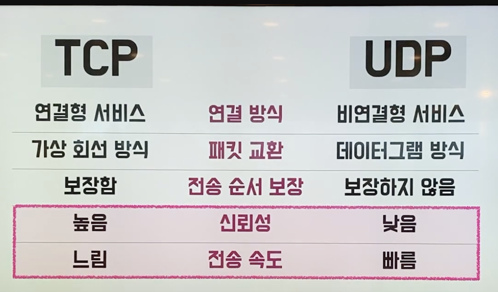
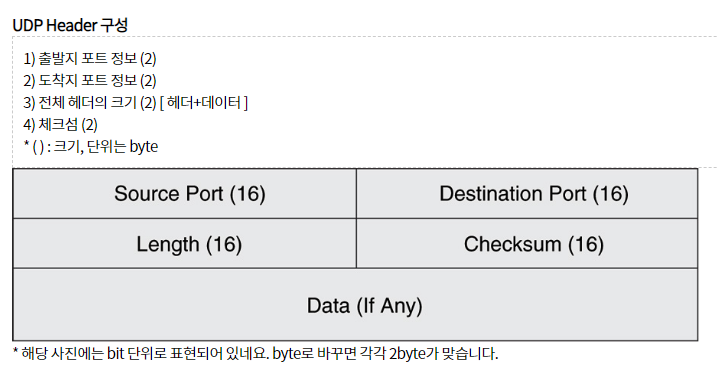
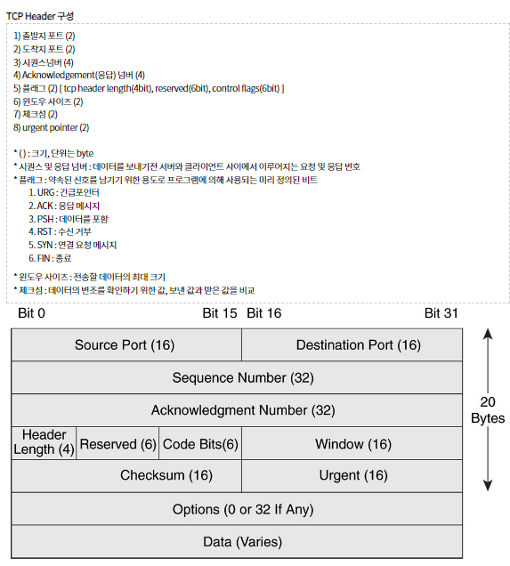

### **[chapter 02_TCP/IP ] (1/2)**

1. 소켓 작성
2. 서버 접속
3. 데이터 송수신.

---

### 1. 소켓을 작성한다.

**[프로토콜 스택 내부 구성]**

- 애플리케이션에서 데이터 송신을 시작한다.
- 소켓라이브러리를 사용해 리졸버로 DNS 서버를 조회한다
- OS내부에 있는 프로토콜 스택이 그 다음 작업을 의뢰 받는다.
- TCP혹은 UDP로 데이터를 송수신한다.
- IP프로토콜로 패킷 송수신 동작을 제어한다.
    - **ICMP** : 패킷을 운반할 때 발생하는 오류를 통지하거나 제어용 메시지를 통지할 때 동작
    - **ARP** : IP주소에 대응하는 이더넷의 MAC주소를 조사할 때 사용합니다.
- LAN 드라이버는 LAN 어댑터의 하드웨어를 제어합니다.
- 그 아래에 있는 LAN어댑터가 실제 송수신 동작. 즉 케이블에 대해 송수신하는 동작을 실행합니다.

**[소켓은 통신 제어용(제어정보 기록)]**

- ‘netstat’를 터미널에 입력하면 네트워크 상태를 확인할 수 있음.
    - 통신 상대의 IP주소, 포트번호, 통신 동작 진행 상태 등의 소켓의 ‘**통신 제어정보**’ 확인 가능

**[소켓을 호출할 때 동작]**

- ‘socket’ 메서드를 호출, 프로토콜 스택에 의뢰해 소켓을 생성
- 소켓 한개가 사용하는 메모리 영역을 확보 (통신 이전이면 초기 상태를 메모리에 기록)
- 프로토콜 스택은 소켓에 대한 디스크립터를 어플리케이션에 알려줌
- 디스크립터를 통해 프로토콜 스택에 의뢰
- 디스크립터만 있으면 프로토콜 스탯이 소켓의 통신상태, 상대 소켓등 기타 정보를 알 수 있음.

### 2. 서버에 접속한다.

접속동작 : → 데이터 송수신이 가능한 상태고 만드는 것

- 초기상태 : 정보가 없음. 접속하려는 소켓에 대한 IP주소와 포트번호가 필요함
    - connect메소드는 애플리케이션이 알고 있는 상대 소켓의 IP주소 및 포트 번호를 프로토콜 스택에 알려저 socket에 기록하는 일을 수행함
- 소켓에 접속하는 connect 수행시 데이터 송수신 메모리 버퍼도 확보함

**[맨 앞에 헤더를 배치(제어 정보 기록)]**

- 소켓의 제어정보
    - 이더넷/IP헤더 + TCP헤더 : 클라이언트와 서버가 통신하기 위해서 필요한 정보. 소켓의 헤더에 포함되어 보내짐
- 소켓(프로토콜 스택 메모리 영역)에 기록되는 정보
- 소켓의 제어 정보에 따라서 프로토콜 스택의 동작 대부분이 결정지어 지기 때문에 결합도가 매우 높다.****

**[접속동작] 3 way handshake**

- ‘connect’를 호출하여 상대 IP와 포트 번호를 함께 쓴다.
- 프로토콜 스택의 TCP담당이 상대와 정보를 주고받은 정보를 기록하는 다음 과정을 거친다(송신처와 수신처 포트 번호등의 중요한 정보)
    - 상대 소켓(IP주소와 포트번호)지정과 헤더 설정이 끝나면 SYN 비트(컨트롤 비트)를 1로 설정한다
- TCP헤더 생성 이후 프로토콜 스택 내부의 IP담당에게 넘겨주어 패킷 송신 동작을 실행하도록 한다. 여기서 송신한 패킷은 상대 서버의 IP담당이 받아 TCP담당에게 넘겨줌)
- 상대 소켓의 TCP담당은 받은 패킷의 수신처 포트번호에 적힌 소켓을 찾는다. 소켓을 지정하여 필요한 정보를 기록하고 응답을 보낸다.
- 응답을 보낼 때, SYN을 1(시퀀스 초기번호)로 설정하고 TCP 헤더에 필요 정보를 설정한다. 추가로 패킷을 성공적으로 받았다고 알리는 ACK 비트를 1로 설정한다.
- 생성된 헤더 정보를 IP 담당에게 넘겨 다시 응답한다.
- 응답을 받은 소켓은 SYN 비트를 확인하여 접속이 성공했는지 보고 성공이라면 접속 완료를 기록한다. 그리고 상대 소켓에 패킷을 잘 받았다는 ACK 비트를 1로 만든 패킷으로 응답한다.

### 3. 데이터를 송수신 한다.

1. write 메서드를 호출. 송신하고자 하는 데이터를 프로토콜 스택에 넘긴다
    - 어플리케이션에서 받은 데이터를 프로토콜 스택 내부의 버퍼 메모리 영역에 우선 저장한다.
        - 이유는, 어플리케이션에 건네주는 데이터의 크기는 프로토콜 스택이 제어할 수 없기 때문에 받은 데이터를 곧바로 보내면 데이터 송수신 동작이 지나치게 많이 일어나서 네트워크 효율이 떨어진다.
        - 패킷의 최대크기인 MTU에서 헤더를 제외한 MSS 만큼의 최대 데이터를 보낼 수 있다. (이것보다 작은 데이터를 보내는 경우 패킷이 예상치 못하게 나누어지지 않는다)
        - 하지만 항상 버퍼를 꽉 채워서 데이터를 보내는 경우 대기 시간이 길어지므로 송신 동작이 지연된다.
        - 네트워크 이용 효율을 중시하는지, 송신 동작 시간을 중시하는지 잘 절충해야한다. (프로토콜 스택을 구현한 OS에서 담당하며 어플리케이션 레벨에서 어느 정도 설정을 할 수도 있다)
2. 데이터가 크면 분할해서 보냄
3. ACK 번호를 사용해 패킷이 도착했는지 확인
    - **ACK 번호 = 수신을 완료한 바이트 + 시퀀스번호**
    - 최초 3way handshake를 할 때 초기 시퀀스 번호를 함께 주고받는다.
        - 초기 시퀀스 번호를 악용할 수 있기 때문에 난수로 설정하여 미리 주고받는다.
    - 이후 `최초 시퀀스 번호 + 데이터의 크기` 만큼의 데이터를 수신했다면 그것에 대한 확인으로 `지금까지 수신한 바이트 + 시퀀스번호` 숫자를 ACK로 지정하여 응답한다.
        - 데이터의 크기는 어떻게 알 수 있을까? 보낸 패킷에 헤더길이를 빼면 수신한 데이터의 크기를 유추할 수 있기 때문에 따로 기재하지 않는다.
    - 이후 송신할 데이터를 시퀀스 번호로 지정하고 송신하고, 동일하게 수신한 마지막 바이트 + 시퀀스번호를 ACK로 응답한다.
    - 시퀀스 번호와 ACK 번호로 누락된 패킷 여부를 알 수 있다. 만일 누락되었으면 송신 버퍼 메모리에 저장되어 있는 데이터를 재송신한다.
        - TCP는 누락을 검출하고 회복 처리를 한다
        - LAN 어댑터, 버퍼, 라우터는 회복 조치를 취하지 않는다. 오류가 검출되면 패킷을 버린다.
        - TCP 여러번 패킷을 재송신해도 오류가 난다면 동작을 중지하고 애플리케이션에 오류를 통지한다.
4. 패킷 평균 왕복 시간으로 ACK 번호의 대기 시간을 조정한다
    - ACK가 오지않는 것으로 패킷 유실을 판단하는데 ACK를 평생 기다릴 순 없으니 타임아웃 값 만큼 기다린다.
5. 슬라이딩 윈도우(Sliding window) 제어 방식으로 ACK번호를 관리한다.
    - ACK번호를 기다리지 않고 (핑퐁 방식이 아닌) 연속해서 복수의 패킷을 보내는 방식
        - 장점 : ACK번호를 기다리는 시간이 낭비되지 않음.
        - 단점 : 수신측의 총 용량(능력)을 초과해서 패킷을 보내는 사태가 일어날 수 있음
            - 해결방법 : 이것을 해결하기 위해 슬라이딩 윈도우 방식에서 **수신 측에 빈 버퍼 최대 사이즈(윈도우 사이즈)를 TCP 헤더의 윈도우 필드에 기록**하여 송신측에 알려준다.
6. **ACK번호와 윈도우를 합승한다.**
    - ACK번호와 윈도우 사이즈를 각각 다른 패킷에 송신하면 주고받는 패킷이 너무 많기 때문에 효율적이지 않다.
    - 둘 중 하나만 생성되었을 때 기다리다가 두 개가 모두 일어나면 함께 하나의 패킷으로 송신한다.
    - 복수개의 ACK가 생겼을 때도 최후의 것만 송신한다.
    - 복수 윈도우 통지가 발생해도 최후 윈도우 사이즈만 보낸다.
7. HTTP 응답 메시지를 수신한다.
    - 프로토콜 스택이 HTTP 요청 메세지를 모두 보면 응답 메세지를 수신해야한다.
    - `read` 메서드를 호출해 프로토콜 수택이 수신 버퍼에 응답 메세지를 수신한다.
    - 응답 메세지가 일정 시간 후 도착해 수신 버퍼에 담기면 프로토콜 스택은 그것을 추출해 어플리케이션에 넘겨준다.
    - 수신 데이터에 TCP 헤더 정보를 통해 누락된 데이터가 없는지 확인하고 ACK를 응답한다. 데이터 조각을 버퍼에 보관하고 원래 데이터로 복원하여 어플리케이션에 보낸다.
    - 어플리케이션에 데이터를 추출한 타이밍에 윈도우 사이즈를 상대에 통지한다.

- **TCP와 UDP는 각각 무엇이고 이들의 차이점에 대해서 알려주시고 각각 언제 사용하면 좋을지 알려주세요.**

  

    - **TCP**는 **연결형, 신뢰성** 전송 프로토콜 입니다. 연결 지향적 서비스를 제공하기 위해 데이터를 전송하기 전에 **3way handshaking을 하여** 두 호스트의 전송 계층 사이에 논리적 연결을 설립합니다. 신뢰성 있는 서비스를 제공하기 위해 **오류제어, 흐름제어, 혼잡제어 등을 실행합니다.** 신뢰성을 보장하기 위해서 header가 더 크고 속도가 비교적 느리다는 단점이 있습니다.
    - **UDP**는 **비연결형, 비신뢰성** 프로토콜로 **3-way handshake등의 세션 수립과정이 없습니다**. 또한 비신뢰성 프로토콜로 **흐름제어, 오류제어, 혼잡제어를 제공하지 않습니다.** 이러한 단순성 덕분에 적은양의 오버헤드를 갖고 수신여부를 확인하지 않아도 되어 속도가 빠릅니다.

  즉 , → TCP는 신뢰성이 중요한 통신(HTTP, File전송)등에 쓰이고 , UDP는 실시간성이 중요한 통신(동영상 스트리밍)등에 주로 사용됩니다.

- TCP/UDP 헤더 차이

  https://websecurity.tistory.com/92

  ### UDP HEADER

  

  ### TCP HEADER

  

- TCP인지 UDP인지 확인하는 방법

  스트리밍 서비스가 UDP 또는 TCP를 사용하는지 확인하는 가장 간단한 방법은 네트워크 패킷을 캡처하고 분석하는 것입니다. 다음은 몇 가지 방법입니다:

    1. 패킷 캡처 도구 사용: Wireshark와 같은 패킷 캡처 도구를 사용하여 네트워크 트래픽을 캡처하고 분석할 수 있습니다. 해당 도구를 사용하면 패킷 헤더 정보를 확인하여 사용된 프로토콜을 확인할 수 있습니다.
    2. 포트 번호 확인: TCP와 UDP는 각각 고유한 포트 번호를 사용합니다. 일반적으로 TCP는 80(HTTP), 443(HTTPS), 8080 등을 사용하고, UDP는 123(NTP), 53(DNS) 등을 사용합니다. 스트리밍 서비스가 어떤 포트 번호를 사용하는지 확인하여 TCP 또는 UDP를 유추할 수 있습니다.
    3. 서비스 문서 또는 공식 지원 문서 확인: 스트리밍 서비스 제공 업체는 서비스에 사용되는 프로토콜 및 포트에 대한 정보를 문서 또는 공식 지원 문서에 제공할 수 있습니다. 해당 문서를 확인하여 스트리밍 서비스가 TCP 또는 UDP를 사용하는지 확인할 수 있습니다.
    4. 소프트웨어 분석 도구 사용: 일부 소프트웨어 분석 도구는 네트워크 연결 및 프로토콜 정보를 분석하여 사용되는 프로토콜을 식별할 수 있습니다. 이러한 도구를 사용하여 스트리밍 서비스의 프로토콜을 확인할 수 있습니다.

  이러한 방법들을 통해 스트리밍 서비스가 TCP 또는 UDP를 사용하는지 확인할 수 있습니다.

- 용어 정리