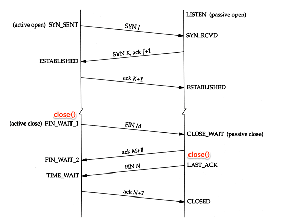
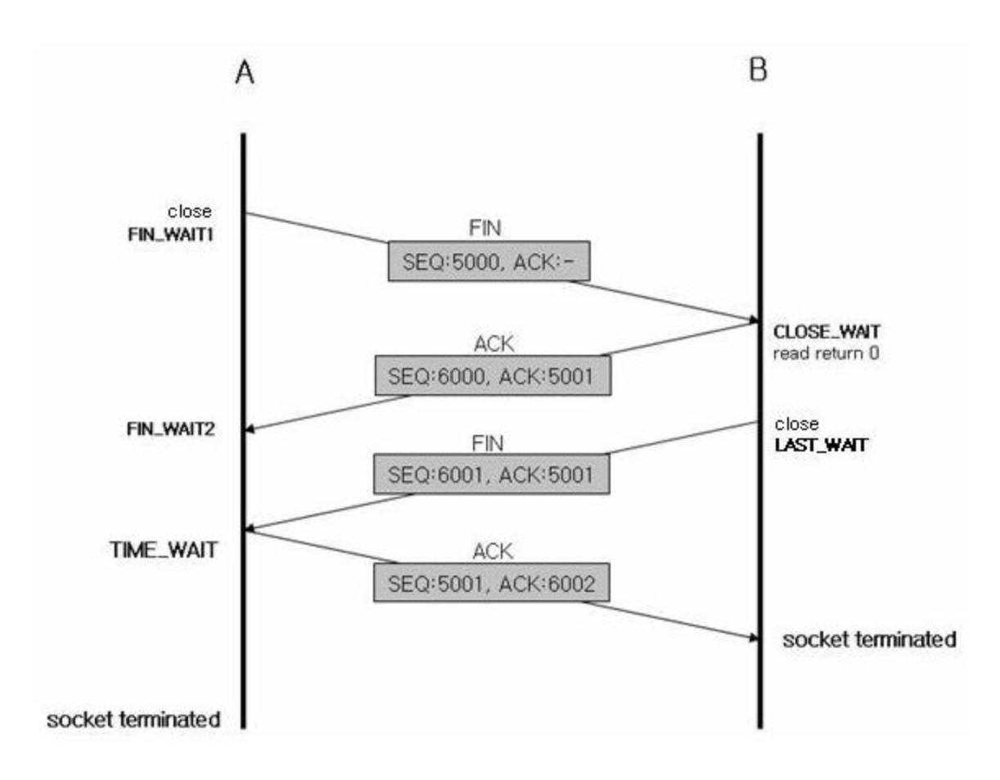
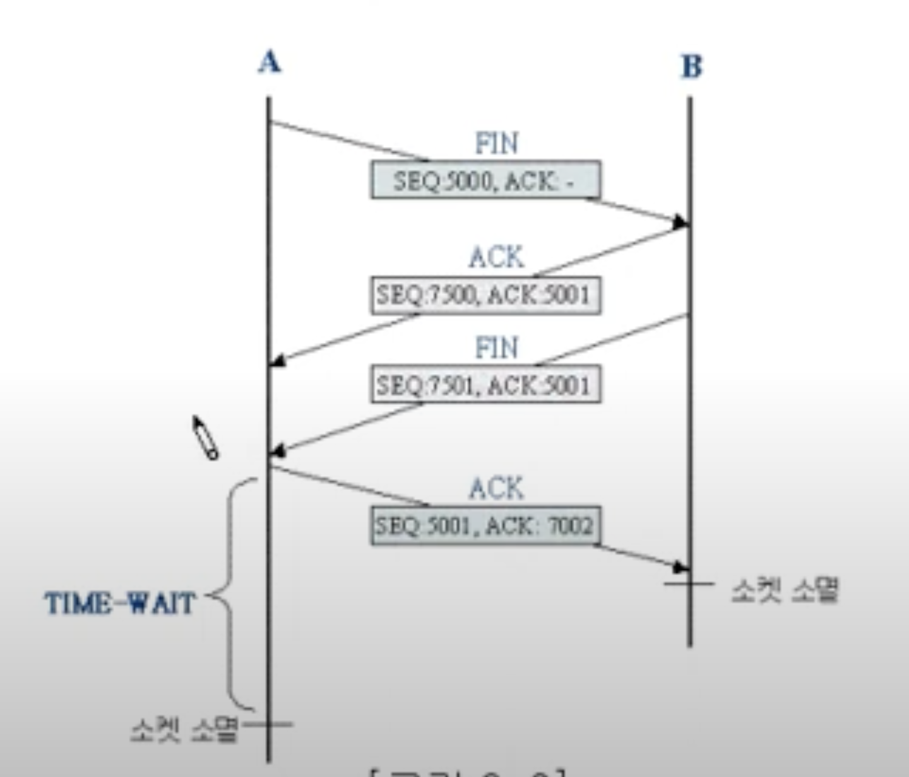
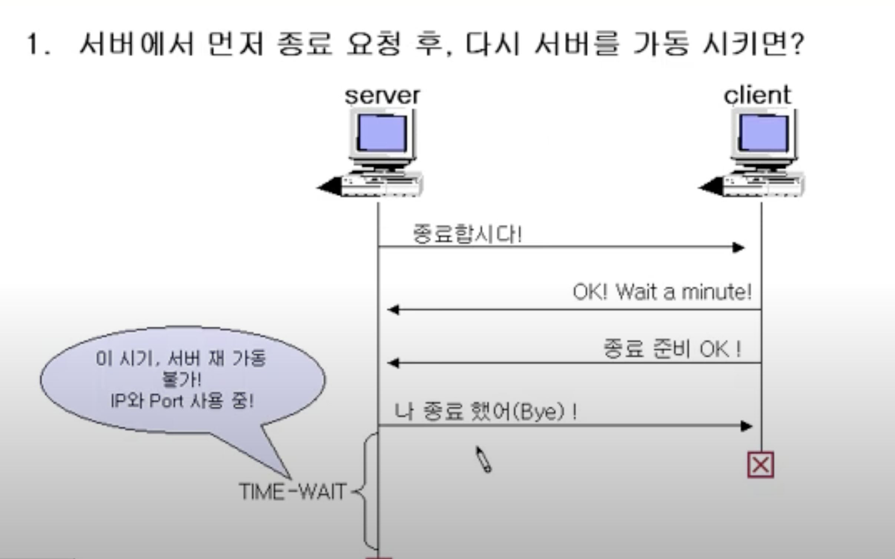
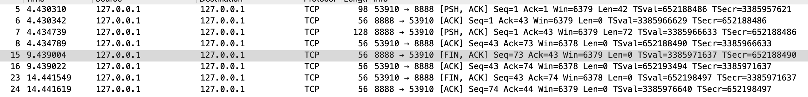
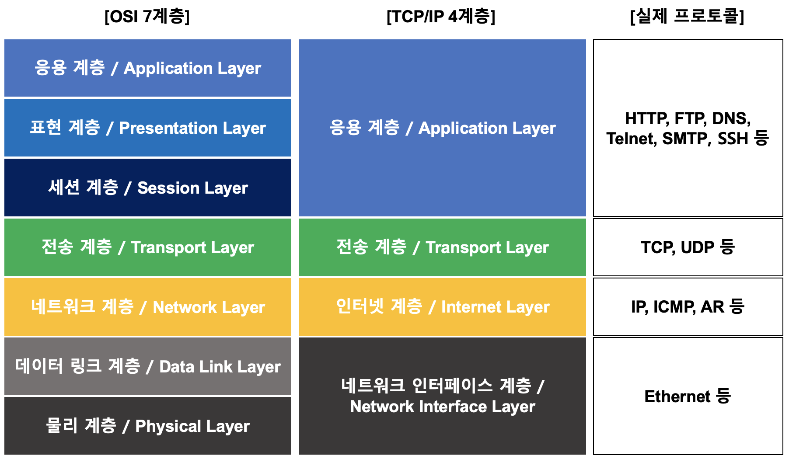

### 4. 서버에서 연결을 끊어 소켓을 말소한다.





- **TIME-WAIT란?**





    - 서버와 클라이언트가 연결된 상태에서 서버를 강제 종료를 하더라도
      4 way-handshake 과정을 거침 (time-wait를 100% 거침)
    - time-wait 상태에 있으면 ip와 port 정보를 유지하는 상태임. 때문에 같은 ip와 port를 사용해 서버를 새로 띄우면 bind exception이 발생함 → `**코드**`
    - time-wait 상태가 생각보다 더 길어질 수가 있음.

    ```java
    - netstat -p tcp -a -n | grep TIME_WAIT | grep 8888
    - netstat -p tcp -a -n | grep CLOSE_WAIT | grep 8888
    - netstat -p tcp -a -n | grep 8888
    
    window : netstat -a -n | findstr ":8888"
    ```

    - **`serverSocket.close();`**를 호출하지 않고도 4-way handshake가 진행되는 이유는 운영체제가 자원 관리를 담당하기 때문입니다.
- **CLOSE-WAIT란?**
    - → 서버로부터 FIN패킷을 받은 시점부터 FIN 패킷을 보낼 때까지의 이 과정이 **`CLOSE_WAIT`** 상태
    - TCP의 **`CLOSE_WAIT`** 상태는 일반적으로 클라이언트에서 발생하는 상태입니다. 이 상태는 클라이언트가 서버로부터 FIN 패킷을 받았지만, 클라이언트가 아직 모든 데이터를 소비하지 않았거나 처리하지 않은 경우에 발생합니다. 클라이언트가 서버로부터 FIN 패킷을 받으면 해당 연결의 리소스가 정리되고 데이터 송수신을 중단합니다. 그러나 클라이언트가 아직 소비하지 않은 데이터가 있는 경우, 이 데이터를 처리한 후에 해당 소켓을 닫아야 합니다.

      간단히 말해서, **`CLOSE_WAIT`** 상태는 클라이언트가 서버로부터 연결 종료 요청을 받았지만, 아직 클라이언트 측에서 종료되지 않은 상태를 나타냅니다. 이 상태에서 클라이언트가 해당 소켓을 닫으면 **`CLOSE_WAIT`** 상태가 해소됩니다.

- **[FIN+ACK] 패킷을 함께 보내는 이유?**
    - FIN 패킷을 보낼 때 ACK패킷을 함께 보내는 이유?

      

      위의 사진을 보면 server→client로 FIN패킷을 보낼때와 그 아래 client→server로 FIN패킷을 보낼 때 ACK 패킷이 함께 보내짐을 알 수 있음

        - FIN과 ACK를 함께 보냄으로써 만약 FIN패킷이 유실되더라도 수신측에서 ACK패킷을 받음으로써 송신측의 패킷 전송상태를 확인할 수가 있음. 따라서 패킷의 손실이나 지연이 발생하더라도 연결종료를 안전하게 수행할 수가 있다는 장점.
        - 만약 ACK패킷을 같이 보내지 않은 상황에서 FIN패킷 유실이 일어나게되면 연결종료가 지연될 수가 있음. ACK 패킷을 함께 보내는 것은 실제로 더 안전한 방식이며, 데이터의 정확한 전달과 연결의 안전한 종료를 보장한다고 볼 수가 있음.

          참고 : http://www.ktword.co.kr/test/view/view.php?m_temp1=2436


### 5. IP와 이더넷의 패킷 송.수신 동작 (IP 프로토콜)



---

- 이더넷의 패킷 : MAC헤더, IP헤더, TCP헤더, 데이터조각
- IP에서의 패킷 :  IP헤더, TCP헤더, 데이터조각
    - 패킷의 송신처에서 패킷 생성
    - header에 제어정보를 입력
    - 가까운 중계 장치에 송신
    - 패킷을 중계장치에 계속 송신하면서 수신처에 패킷 도착

---

→ IP가 목적지를 확인 후 다음 IP의 중계장치인 라우터를 가르킴

→ 서브넷 안에 있는 이더넷이 중계 장치까지 패킷을 운반

***MAC 헤더*** : 이더넷용 헤더

***IP용 헤더*** : IP용 헤더

---

- 라우터(Router)(외부망) - 네트워크 계층
- 서브넷(Subnet)(내부망) - 네트워크 계층
- 이더넷 - 데이터 링크 계층
    - 이더넷을 기반으로 하는 랜 (Local Area Network)은 허브, 스위치 등을 사용하여 장치들 간의 통신을 관리.
    - 허브(Hub) - 데이터 링크 계층
        - 모든 포트로 브로드캐스팅 → 효율 떨어짐
    - 스위치 - 허브에서 발전된 형태
- TCP이후 IP layer에서 `IP헤더`를 만들어 TCP의 헤더 앞에 붙임.
    - IP 헤더에서의 수신처 IP주소에는 통신 상대의 주소를 설정함
    - 송신처 IP주소는 송신처가 되는 LAN어댑터를 판단해서 주소를 설정함

### 6. UDP 프로토콜을 이용한 송.수신 동작

- UDP 헤더 :
- 수정 송신이 필요 없는 데이터의 경우
    - TCP의 경우 데이터 손실시 3way-handshake를 통해서 재전송을 해줌
        - 손실된 패킷을 확인하고 그 패킷을 다시 보내야 하기 때문에 복잡함 오버헤드가 여기에서 발생함
    - UDP의 경우 재전송이 오히려 불필요한 데이터들에 사용하면 적합한 프로토콜
        - 패킷하나에 데이터를 수용할 수 있을만큼 길이가 짧은 경우 데이터를 전부 다시보냄.
        - 수신 확인 응답 패킷이 아닌, **`회신 자체`**가 수신 확인 응답을 대신하는 형태이기 때문에 TCP의 수신확인처럼 번거로운 데이터들이 필요가 없음.

          ex : DNS 응답 데이터에는 요청한 도메인 이름에 대한 IP 주소 정보와 관련된 정보

- 제어용 짧은 데이터(DNS 서버 조회)
    - DNS 에서 일정시간 회신이 없을 경우 데이터를 재전송 해야하는데, 이건 구현하는 것
- 음성 및 동영상 데이터
    - 실시간성이 중요한 데이터
    - 영상은 되돌릴 수 없기 때문에 데이터가 늦게 도착하면 쓸모가 없음
    - 그렇다고 고속 회선을 쓰기에는 적정기술 측면에서 낭비가 큼
    - 이처럼 다시 보낼 필요가 없는 데이터, 보내도 사용이 불간으한 데이터를 다룰 때 UDP를 사용해 데이터를 보내는게 더 효율적임.