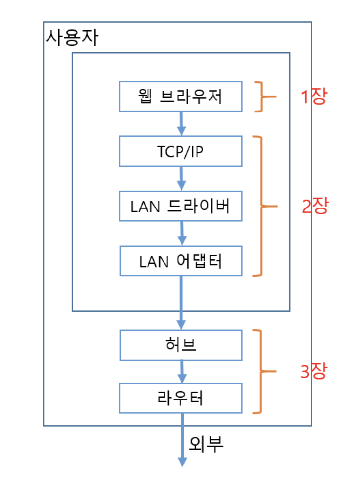
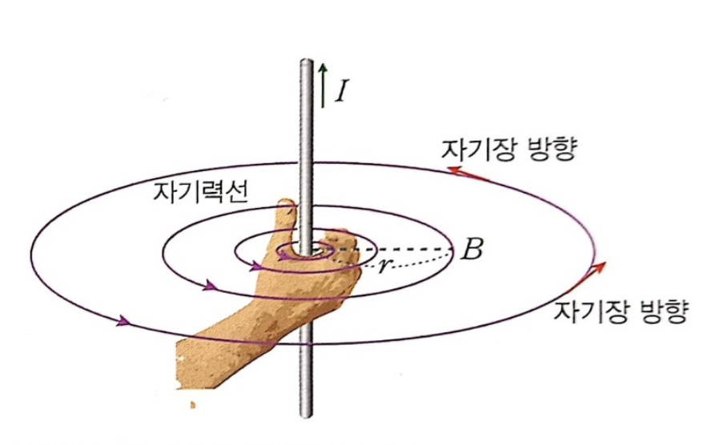
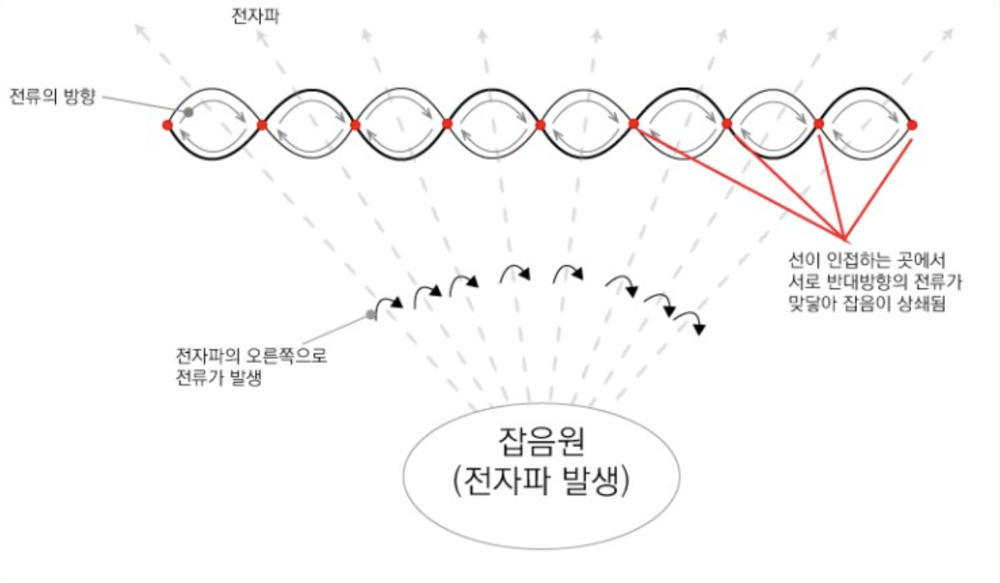
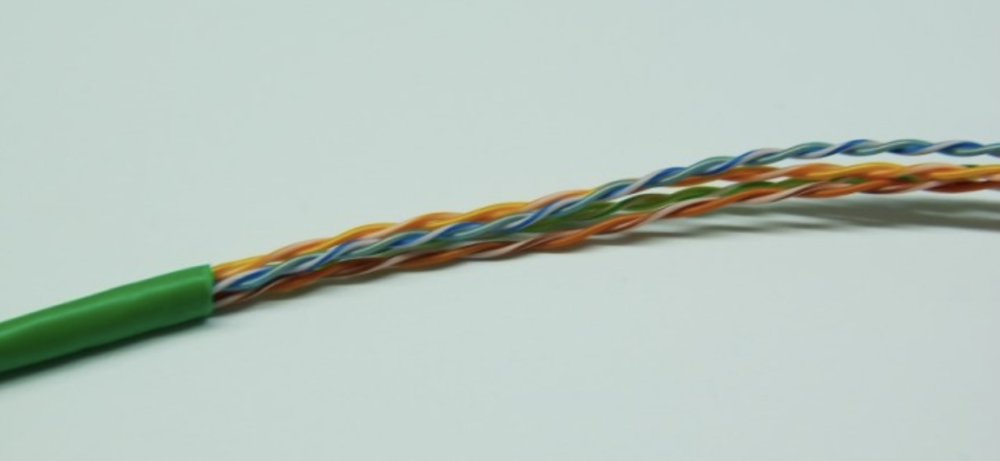

### **[chapter_03]: (9월 3일) : 허브,스위치,라우터**

---

> 케이블과 리피터, 허브속을 신호가 흘러간다
스위칭 허브의 패킷 중계 동작
라우팅 패킷 중계 동작
라우터의 부가 기능
>

---

- **1장. 케이블과 리피터, 허브 속을 신호가 흘러간다.**

  

  **클라이언트(내부) →
  `LAN어댑터 → 리피터허브 → 스위칭허브 → 라우터 → 인터넷 접속용 라우터`**
  **→ 인터넷(외부)**

    - **LAN어댑터 (in) →**
        - 신호를 전달해야 하기에 신호를 약화시키면 안됨. ‘`잡음`’이 신호 변형의 원인중 하나.
          → **트위스트 페어 케이블**을 사용한 구조를 사용해서 `잡음`을 최대한 방지.
            - 신호가 약해지는 특징
                1. 송신측의 신호는 원래 각진형태지만 수신측의 신호를 보면 각이 뭉개져있음
                2. 또한 신호의 높이가 약해짐
                3. 신호의 파형이 왜곡됨

              → 전체적인 에너지가 떨어지는 느낌

            이렇게 신호가 약해지면 0과 1을 잘못 판독해서 통신 오류의 원인이 됨
            
        - 신호를 전달하는 케이블을 꼼(twist) 형태로 만들어 잡음을 방지한다.
            - 잡음의 원인은 주로 전자파 → 선을 twist(꼼)함으로써 막을 수 있음.

                
                위 사진의 자기장이 방해가 되는 전류가 생성되는 형태
                
            

            
            UTP 케이블은 피복 (시스체) 와 절연체 (내부 피복)을 제외하고는 모두 금속(구리)으로 만들어져 있습니다. 여기에 전자파가 닿으면 전자파의 진행방향의 오른쪽(위의사진) 전류가 생기는 성질이 있음
            
            이때 발생되는 전류가 UTP신호를 왜곡시키고 파형을 무너뜨리게 됨
            
            위의 사진처럼 2가닥의 선을 꼬아두면 전류의 방향은 반대가 되어 잡음으로 인해 만들어진 전류는 상쇄되어 전류의 강도가 약해짐.
            
        - 또한 케이블 안의 선에 의해 누설되는 전자파에
        - 또한 신호선에 전류가 흐르면 전류에 의해 주위에 전자파가 생기는데, 이것에 의해서도 **CROSSTALK**가 발생하여 잡음이 됨.
        → 이또한 신호선을 마주 꼬는 것으로 해결
        - 이 외에도 신호선 사이 거리유지를 위해 신호선 사이에 구분판을 넣거나 전자파를 차단하는 shield 라는 피복을 입히는 등 여러 해결방법 이 있음
        
        **→ 리피터허브 (out)**
        
        - **리피터 허브의 특징**
            - 전체 케이블에 신호를 그대로 송신함
            - 리피터 허브의 끝의 커넥터에는 **MID/MDI-X** 라는 전환 스위치가 붙어있음.
            (주로 크로스 케이블을 사용한 MDI-X 사용) (Media Dependent interface) - ( Crossover)
            이걸 사용해 허브들을 접속함
            - 그 다음 신호인. 스위칭허브, 라우터, 서버등에 도달해서 **디지털 데이터**로 변환되고
            FCS(Frame Check Sequence)를 검사하는 곳에서 데이터가 맞는지 판명된 후 송신중 변경된 데이터는 폐기처리함. 폐기시에 ACK를 돌려주지 않으므로 TCP 담당 부분에서 패킷을 다시 보냄
- **2장. 스위칭 허브는 주소 테이블로 중계한다.**
    - **스위칭 허브**의 포트에는 수신처 MAC주소를 검사하지 않고 모든 패킷을 수신하여 **버퍼 메모리에 저장**하기 때문에 스위칭 허브의 포트에는 LAN 어댑터와 달리 물리적인 포트에 MAC주소가 할당되어 있지 않음
    - 스위치 내부에 있는 MAC 주소와 포트 번호를 등록하는 테이블이 있는데 이곳에 MAC주소와 포트번호를 참고해서, 패킷을 중계할 때 어디에 패킷을 송신해야 할지를 판단합니다.

    ---

    - 스위칭 허브 : MAC 주소의 기기가 존재해야만 송신 동작을 실행함
    - 리피터 허브 : 들어온 모든 신호를 모든 포트에 뿌리므로 동시에 두 개 이상의 신호가 들어오면 패킷이 충돌하기 때문에 복수의 신호를 동시에 흘릴 수 없음.
      따라서 중계할 수 있는 패킷의 수는 스위칭 허브쪽이 리피터 허브보다 많음.

    ---

- **3장. 라우터의 패킷 중계 동작(****)**

    **스위칭 허브**는 MAC헤더에 기록되어 있는 수신처 MAC 주소로 중계 대상을 판단했음
    **라우터**는 크게 `중계부분`(IP 담당), `포트부분`(LAN 어댑터) 으로 나뉨. 
    
    라우터는 
    
    - IP주소로 중계 대상을 판단함.
    - 라우터의 포트에 MAC 주소가 할당되어 있음
    - 자신의 주소에 해당하는 패킷만 수신하고 해당하지 않는 패킷을 폐기함
    
    - window에서 ‘route print’를 입력하면 네트워크대상, 네트워크 마스크, 게이트웨이, 인터페이스, 메트릭표를 볼 수 있음
        - ‘게이트웨이’와 ‘인터페이스’는 패킷의 중계 대상을 나타냄
        - 중복되는 게이트웨이와 인터페이스가 있으면 메트릭값이 적은곳으로 송신함.
    - 라우터 패킷 수신 동작
        1. 신호가 커넥터에 도착하면 PHY(MAU)회로와 MAC회로에서 신호를 디지털 데이터로 변환함
        2. 패킷 끝 부분의 FCS를 대조해 오류 유무를 점검함
        3. 정상이면 MAC 헤더의 수신처 MAC주소가 자신에게 해다하는지를 조사하여 해당하면 패킷을 수신 버퍼 메모리에 저장함. (만약 수신 MAC 주소가 자신이 아니라면 폐기)
    - 해당하는 경로가 없으면 1행의 0.0.0.0의 기본경로로 감.
    - 패킷은 유효기간이 있기때문에(TTL : Time To Live) 라우터를 경유할 때마다 이 값을 1씩 줄이고, 이 숫자가 0이되면 생존기간이 만료되는 것으로 간주하고 폐킷을 폐기함.(순환 상태를 막기 위함)
    - 큰 패킷은 조각 나누기(fragmentatioin)이라는 기법으로 패킷 짧게 나누어 중계함.
    - 상대의 IP주소가 결정되면 ARP로 IP주소에서 MAC 주소를 조사하고, 결과를 수신처 MAC주소로 설정함.
    - 라우터 : IP , 하드웨어
    스위치 : 이더넷 , LAN선(회선) 에 기초함
        
        통신 상대까지 패킷을 전달하는 전체 동작은 **라우터**
        
        이 동작시에 다음 라우터까지 패킷을 운반하는 부분은 **스위칭 허브**

- **4장. 라우터의 부가기능**
    - 주소변환
        - 컴퓨터당 고유한 IP를 부여하기에는 IP주소가 너무 부족해짐
          → private과 global로 나눔.
          분리되어 있는 환경의 각각의 private IP는 중복이 허용됨
        - 여기에 수만개의 값을 취할 수 있는 16비트의 포트번호를 사용해서 한개의 글로벌 주소에서 여러개의 private 주소에 대응시키게끔 하여 경우의 수를 더욱 늘림
        -
- **리피터 허브와 리피터 회로의 차이**

참고

https://m.blog.naver.com/PostView.naver?isHttpsRedirect=true&blogId=kwshop89&logNo=220019277267